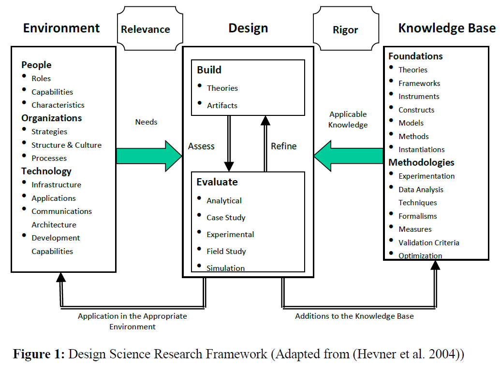
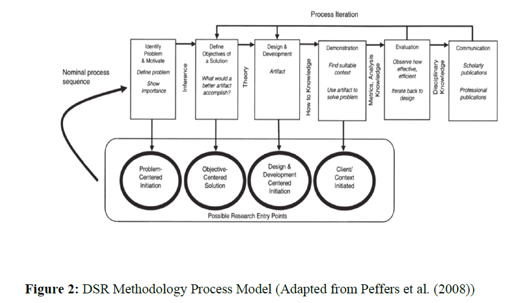

# Design und Konzeption interaktiver Visualisierungen des Produktlebenszyklus zur Vermittlung von Nachhaltigkeit

* Alternativ: Design und Konzeption interaktiver Visualisierungen des Produktlebenszyklus zur Vermittlung von Nachhaltigkeit in der Bildung
* Alternativ: Design und Konzeption interaktiver Visualisierungen des Produktlebenszyklus für eine Bildungs- bzw. Informationsplattform über Nachhaltigkeit

---

> Schlagworte: _interaktive Visualisierung, Nachhaltigkeit, Produktlebenszyklus, Design, Bildung für nachhaltige Entwicklung, Kommunikation_

---

	
Zusammenfassung der Sprechstunden (chronologisch)

### Meeting 18.1.

> Der Terminus _Visualisierung_ kann beibehalten werden, sollte aber erweitert werden, um die Verbraucher/Nutzer einzubeziehen. Das heißt, dass die Kommunikation der Visualisierung berücksichtig werden muss. Außerdem wurde hinterfragt, ob die Nennung der UN Nachhaltigkeitsziele Bestandteil des Titels werden soll.
>
> Ein weiterer Hinweis betrifft die Rolle der Daten in diesem Thema. Stehen diese bereits fest? Wie sollen die Daten eingesetzt werden? In welcher Form sollen diese vorliegen? Muss eine Änderbarkeit bedacht werden? Gibt es Standards?
>
> Außerdem muss sich die Frage gestellt werden, wie Nachhaltigkeit visualisiert werden kann. Sollten Visualisierungen im Prozess der Thesis entstehen, sind spätestens zur Evaluation Nutzer notwendig, um u.a. die Usability zu testen. 
>
> In die Betrachtung ist die Entwicklung einer Plattform sehr interessant, da viele Gestaltungsmöglichkeiten bereits frühzeitig im Prozess berücksichtig werden können.
>
> Auf Basis der gemachten Anmerkungen wurde das Thema auf die Entwicklung und Evaluation von interaktiven Visualisierungen mit Webtechnologien eingegrenzt. Die Nennung der UN-Nachhaltigkeitsziele wurde aus dem Titel entfernt, könnte in der Ausarbeitung aufgegriffen werden.

### Meeting 24.1.

> Herr Noss weist darauf hin, dass der Produktlebenszyklus schließlich den Konsumenten kommuniziert werden muss. Dies sollte in der Arbeit betrachtet werden. Bzgl. des Titels wird empfohlen _Design und Konzeption_ zu nehmen, um Gestaltungsfreiheit in der weiteren Ausarbeitung offen zu halten.
>
> Weiterhin bleibt der Begriff der _Evaluation_ fraglich. Auf der einen Seite stellt dies ein wichtigen Schritt zur Überprüfung/Verprobung der Lösungsansätze dar, könnte auf der anderen Seite aber den Umfang für eine Thesis überschreiten und gleichzeitig das Risiko bergen, keine Nutzer in ausreichendem Maße bekommen zu können. Dies sollte mit Frau Nowak-Meitinger besprochen werden.
>
> Der Begriff _Plattform_ sollte nicht in den Titel aufgenommen werden, sondern erst im Verlauf der Arbeit entschieden werden, um das Ganze handhabbarer zu halten. Auch sollte der Begriff _Webtechnologien_ aus dem Titel entfernt werden, da dies Mittel zum Zweck ist. 
> 
> Auf die Fragen, ob auf die Betrachtung von vorhandenen Nachhaltigkeitssiegel Bezug genommen werden soll, wird dies bejaht. Wie ausführlich kann während der Arbeit begründet werden. Außerdem können hieraus Informationen bzgl. der Darstellung der Siegel bzw. der eingesetzten Daten erlangt werden. 
> 
> Abschließend wurde von Herrn Heiko Riffeler (gjuce Köln) gesprochen, der an einem ähnlichen Projekt arbeitet. Hier besteht die Option einer Kontaktaufnahme für ein Interview.

### Meeting 3.2.

> Im Gespräch mit Frau Nowak-Meitinger wurde bzgl. des Titels angeregt, die Visualisierung weniger konkret auf ein allgemeines, internationales Nachhaltigkeitssiegels aufzuhängen. Dies begründet sich aus der Fülle an bereits vorhandenen Siegeln und scheint nicht zielführend für die Ausarbeitung zu sein. Letztlich stellt aber die Frage nach der Visualisierung von Nachhaltigkeit ein relevantes Thema insb. im Kontext der Bildung und Sensibilisierung von Nutzenden/Konsumenten dar. Dies sollte in den Titel aufgenommen werden.
>
> Der Begriff _Nachhaltigkeit_ ist nicht eindeutig definiert und weist je nach Betrachtung verschiedene Dimensionen auf. Zu den bekanntesten zählen u.a. die Triple Bottom Line (https://online.hbs.edu/blog/post/what-is-the-triple-bottom-line). Hier sollte für die Arbeit eine Einführung in die möglichen Definitionen gegeben werden (siehe dazu u.a. Sustainability Manifest).
>
> Spannend wird die Identifikation und Extraktion der zu visualisierenden Nachhaltigkeitsdaten. Diese können aus dem Produktlebenszyklus, den Lieferketten, der verbrauchten Energie etc. gewonnen werden. Allerdings ist unsicher, welche bzw. ob Hersteller über alle im Produktlebenszyklus beschriebenen Phasen erfasst werden. Dies gilt es zu beachten und zu evaluieren, inwieweit mit dieser Unsicherheit umzugehen ist.
>
> Bezüglich einer interaktiven Visualisierung kam die Idee generativer Lösungen in den Sinn. Statt einzelne Produkte dem Lebenszyklus zu unterziehen und aus den so gewonnen Daten Visualisierungen umzusetzen, könnte aus einer generalistischen Sicht interaktive Visualisierungen generiert werden. Hierzu sind Recherchen über den Stand der Wissenschaft durchzuführen.
>
> Bzgl. der Fragestellung sind die Fragen F1, F6, F7, (F9) zielführend. F5 sowie F8 sind ggf. als Anwendungsfall als gesetzt zu betrachten.
>
> Für die Einleitung/Motivation ist es sinnvoll Beispiele von _(interaktiven) Visualisierungen von Nachhaltigkeit_ aufzuführen (z.B. Darstellung in den SDG-Reports oder CSR-Reports von Unternehmen). Hierfür kann es trotzdem sinnvoll sein, bei vorhandenen Nachhaltigkeitslabels zu untersuchen, wie diese mit der Darstellung der Informationen umgehen.
>
> Ein geeignetes wissenschaftliches Vorgehen ist zu recherchieren und auszuwählen. Für Gestaltungsartefakte etabliert sich das Design Science Research Paradigma. Alternativ gibt es das ASSERT Framework [nach Bill Ferster](https://www.researchgate.net/profile/Bill-Ferster).
>
> Wichtig für den nächsten Schritt ist eine vertiefende Recherche zu den Themen und eine Neuformulierung der einzelnen Abschnitte des Exposés.

---

## Problemstellung und Motivation

Mit Blick auf die Eindämmung der Klimakrise werden die bestehenden Systeme in Wissenschaft, Gesellschaft und Ökonomie in Frage gestellt. Tragen bspw. die bestehenden Formen des Wirtschaftens, der Mobilität, der Energieversorgung oder des Konsums zum Klimawandel bei? Können diese im Sinne einer _nachhaltigeren Entwicklung_ verändert werden? Wenn ja, wie würde eine Umgestaltung aussehen oder bedarf es gänzlich neuer Formen, um _nachhaltiger_ zu sein? Mit diesen Fragen beschäftigen sich die Wissenschaftsdisziplinen wie Wirtschafts-, Natur- und Sozialwissenschaften. [PM11]

Auch auf internationaler Ebene - bspw. die Vereinten Nationen - werden Beiträge zur Nachhaltigkeitsentwicklung formuliert. Das seit 2015 existierende Programm _Agenda 2030 für nachhaltige Entwicklung_ stellt das gemeinsame Konzept für Frieden und Wohlstand dar. Im Kern befinden sich die _17 Sustainable Development Goals (SDGs)_. [PM2]

Hauptverursacher des Klimawandels sind die Menschen [PM12]. Damit eine nachhaltige Transformation gelingen kann, ist eine Beteiligung insbesondere von Kindern und Jugendlichen in dem Gestaltungsprozess notwendig. Hierfür werden geeignete Angebote für die Vermittlung des Handels und dessen Auswirkungen benötigt. [PM14]

Ein konkreter Handlungsbereich betrifft das Konsumverhalten. Oft wissen Verbraucher nicht, wie Produkte hergestellt werden, wo die Rohstoffe bezogen werden, unter welchen Herstellungsbedingungen produziert wird, welcher Ressourcenverbrauch zugrunde liegt oder was mit dem Produkt am Ende passiert. Wenngleich die Hersteller mit einer Vielzahl von Produktlabels [NA3, NA4, NA7, NA8, NA9, NA10] versuchen Transparenz zu schaffen, fehlt für Verbraucher der Zugang zu weiteren Informationen. Eine mündige Entscheidung zu treffen, ob das Produkt die eigenen Anforderungen an _Nachhaltigkeit_ erfüllt, ist demnach schwierig. Die Industrie versucht eigene Labels [NA5] im Handel zu etablieren, die auf das Verbot der EU-Kommission zum Verbot des _Greenwashings_ reagieren. [PM1]

Im Zuge eines Forschungsvorhabens zur Entwicklung eines Informationssystems für die Vermittlung von Nachhaltigkeit von Produkten bzw. Produkttypen, stellen sich eine Vielzahl von Fragestellungen. Eine richtet sich nach geeigneten interaktiven Lösungen zur Darstellung der Informationen. Dabei soll auf Grundlage des Produktlebenszyklus alle Phasen eines Produkts oder Produkttyps veranschaulicht und als Grundlage für Bildungsmaßen in Schulen, Hochschulen, erwachsenen Bildung, Führungskräfteentwicklung oder sonstigen Interessenten eingesetzt werden. Das Ziel soll ein breiter Zugang zu den Informationen für die Bevölkerung und somit eine Sensibilisierung für das Thema _Nachhaltiger Konsum_ zu schaffen.

Aufgrund der Menge an Information (Phasen des Produktlebenszyklus, 17 Nachhaltigkeitsziele mit über 100 Unterzielen und verschiedenen Produkttypen) sowie dem Anspruch an einer allgemeinen Zugänglichkeit (breite Zielgruppe) dieser Informationen, stellt die Darstellung eine Herausforderung dar. 

**Referenzen**

* [PM1] [Kreislaufwirtschaft: Kommission schlägt neue Verbraucherrechte vor und will Greenwashing verbieten](https://ec.europa.eu/commission/presscorner/detail/de/IP_22_2098)
* [PM2] [The 17 Goals - United Nations - Sustainable Development](https://sdgs.un.org/goals)
* [PM3] [7 Ökologische Nachhaltigkeitssiegel - Spiegel](https://www.spiegel.de/gutscheine/magazin/nachhaltigkeitssiegel)
* [PM4] [31 Nachhaltigkeitssiegel - ISPO.com](https://www.ispo.com/know-how/31-nachhaltigkeitssiegel-die-du-kennen-musst)
* [PM5] [Nachhaltigkeitslabel für den Handel - Eco Score und Planet Score unter der Lupe](https://www.oekolandbau.de/handel/unternehmensfuehrung/nachhaltig-wirtschaften/nachhaltigkeitslabel-fuer-den-handel-eco-score-und-planet-score-unter-der-lupe/)
* [PM7] [Öko-Institut e.V.](https://www.oeko.de/)
* [PM8] [Rat für Nachhaltige Entwicklung (RNE)](https://www.nachhaltiger-warenkorb.de/siegel/)
* [PM9] [EU List of existing EU and International Eco-Labels - PDF](https://ec.europa.eu/environment/gpp/pdf/ecolabels.pdf)
* [PM10] [Kompass Nachhaltigkeit](https://www.kompass-nachhaltigkeit.de/)
* [PM11] [Liste vorhandener Nachhaltigkeitsthemen](https://en.wikipedia.org/wiki/Index_of_sustainability_articles)
* [PM12] [Bundesministerium für Umwelt, Naturschutz, nukleare Sicherheit und Verbraucherschutz BMUV](https://www.bmuv.de/kids/artikel/details/es-ist-der-mensch)
* [PM13] [Bildung für nachhaltige Entwicklung](https://www.bne-portal.de/bne/de/einstieg/bildungsbereiche/bildungsbereiche_node.html)
* [PM14] [Umweltbildung und Bildung für nachhaltige Entwicklung - 118/2020 Umwelt Bundesamt](https://www.umweltbundesamt.de/sites/default/files/medien/1410/publikationen/2020-06-29_texte_118-2020_umweltbildung-bne.pdf)

## Stand der Forschung

Um einen ersten Eindruck des Forschungsstands im Kontext der Thesis zu ermitteln, wurden auf Suchmaske der [TH Bibliothek](https://thb-koeln.digibib.net/search/katalog) auf deutscher und englischer Sprache recherchiert. Dabei wurden die folgenden Begriffskombinationen ausgewählt:

| Suchkombinationen                            	|                                                            	| TH Bib (Aufsätze)                                                                                                                                                           	|                                                                                                                                                                                                       	|
|----------------------------------------------	|------------------------------------------------------------	|-----------------------------------------------------------------------------------------------------------------------------------------------------------------------------	|-------------------------------------------------------------------------------------------------------------------------------------------------------------------------------------------------------	|
| deutsch                                      	| englisch                                                   	| deutsch                                                                                                                                                                     	| englisch                                                                                                                                                                                              	|
| "interaktiv* visual*" nachhaltig*            	| "interactive visual*" sustain*                             	| [96](https://thb-koeln.digibib.net/search/eds/list?start=1&count=20&defaults=on&q-al=%22interaktiv*+visual*%22+nachhaltig*&q-ti=&q-au=&q-yr=&q-ky=&q-ib=&q-is=)             	| [8.190](https://thb-koeln.digibib.net/search/eds/list?start=1&count=20&defaults=on&q-al=%22interactive+visual*%22+sustain*&q-ti=&q-au=&q-yr=&q-ky=&q-ib=&q-is=)                                       	|
| interaktiv* visual* nachhaltig*              	| interactive visualization sustainability                   	| [3.142](https://thb-koeln.digibib.net/search/eds/list?q-al=interaktiv*+visual*+nachhaltig*&q-ti=&q-tf=&q-au=&q-yr=&q-ky=&q-co=&q-pb=&q-ib=&q-is=&q-cn=&defaults=on&start=1) 	| [34.387](https://thb-koeln.digibib.net/search/eds/list?start=1&count=20&defaults=on&q-al=interactive+visualization+sustainability&q-ti=&q-au=&q-yr=&q-ky=&q-ib=&q-is=)                                	|
| infografik* nachhaltig*                      	| infographic sustainability                                 	| [343](https://thb-koeln.digibib.net/search/eds/list?start=1&count=20&defaults=on&q-al=infografik*+nachhaltig*&q-ti=&q-au=&q-yr=&q-ky=&q-ib=&q-is=)                          	| [8.807](https://thb-koeln.digibib.net/search/eds/list?start=1&count=20&defaults=on&q-al=infographic+sustainability&q-ti=&q-au=&q-yr=&q-ky=&q-ib=&q-is=)                                               	|
| "interaktive Visualisierung" lebenszyklus*   	| "interactive* visual*" ("life cycle" \| "lifecycle")       	| [12](https://thb-koeln.digibib.net/search/eds/list?start=1&count=20&defaults=on&q-al=%22interaktive+Visualisierung%22+lebenszyklus*&q-ti=&q-au=&q-yr=&q-ky=&q-ib=&q-is=)    	| [3.432](https://thb-koeln.digibib.net/search/eds/list?start=1&count=20&defaults=on&q-al=%22interactive*+visual*%22+%28%22life+cycle%22+%7C+%22lifecycle%22%29&q-ti=&q-au=&q-yr=&q-ky=&q-ib=&q-is=)    	|
| interaktiv* visual* lebenszyklus*            	| interactive* visual* ("life cycle" \| "lifecycle")         	| [683](https://thb-koeln.digibib.net/search/eds/list?start=1&count=20&defaults=on&q-al=interaktiv*+visual*+lebenszyklus*&q-ti=&q-au=&q-yr=&q-ky=&q-ib=&q-is=)                	| [57.136](https://thb-koeln.digibib.net/search/eds/list?start=1&count=20&defaults=on&q-al=interactive*+visual*+%22life+cycle%22&q-ti=&q-au=&q-yr=&q-ky=&q-ib=&q-is=)                                   	|
| infografik* lebenszyklus*                    	| infographic* ("life cycle" \| "lifecycle")                 	| [30](https://thb-koeln.digibib.net/search/eds/list?start=1&count=20&defaults=on&q-al=infografik*+lebenszyklus*&q-ti=&q-au=&q-yr=&q-ky=&q-ib=&q-is=)                         	| [4.929](https://thb-koeln.digibib.net/search/eds/list?start=1&count=20&defaults=on&q-al=infographic*+%28%22life+cycle%22+%7C+%22lifecycle%22%29&q-ti=&q-au=&q-yr=&q-ky=&q-ib=&q-is=)                  	|
| visualisierung* nachhaltigkeit lebenszyklus* 	| visualization sustainability ("life cycle" \| "lifecycle") 	| [358](https://thb-koeln.digibib.net/search/eds/list?start=1&count=20&defaults=on&q-al=visualisierung*+nachhaltigkeit+lebenszyklus*&q-ti=&q-au=&q-yr=&q-ky=&q-ib=&q-is=)     	| [31.131](https://thb-koeln.digibib.net/search/eds/list?start=1&count=20&defaults=on&q-al=visualization+sustainability+%28%22life+cycle%22+%7C+%22lifecycle%22%29&q-ti=&q-au=&q-yr=&q-ky=&q-ib=&q-is=) 	|

Die Suchkombinationen ergaben - insbesondere im Englischen - umfangreiche Ergebnisse aus verschiedenen Wissenschaftsdisziplinen. Für die Thesis werden weitere Eingrenzungen benötigt.

### zu Nachhaltigkeit

Der Begriff _Nachhaltigkeit_ ist nicht eindeutig definiert und weist je nach Betrachtung verschiedene Dimensionen auf. [NA1] Zu den bekanntesten zählen u.a. die Triple Bottom Line [NA3].

**Referenzen**

* [NA1] [Nachhaltigkeit - Wikipedia](https://en.wikipedia.org/wiki/Sustainability)
* [NA2] [Sustainability Topic - MDPI Open Access Journal](https://www.mdpi.com/journal/sustainability)
* [NA3] [What is the Triple Bottom Line](https://online.hbs.edu/blog/post/what-is-the-triple-bottom-line)

### zu interaktiven Visualisierungen

Visualisierung ist eine Technik zur Erstellung von Bildern, Diagrammen oder Animationen, um eine Botschaft zu vermitteln. Die Visualisierung durch visuelle Bilder ist seit den Anfängen der Menschheit ein wirksames Mittel, um sowohl abstrakte als auch konkrete Ideen zu vermitteln. Beispiele aus der Geschichte sind Höhlenmalereien, ägyptische Hieroglyphen, griechische Geometrie und Leonardo da Vincis revolutionäre Methoden des technischen Zeichnens für technische und wissenschaftliche Zwecke. Heutzutage findet die Visualisierung immer breitere Anwendung in Wissenschaft, Bildung, Technik (z. B. Produktvisualisierung), interaktiven Multimedia-Anwendungen, Medizin usw. Ein typisches Beispiel für eine Visualisierungsanwendung ist der Bereich der Computergrafik. Die Erfindung der Computergrafik (und der 3D-Computergrafik) ist vielleicht die wichtigste Entwicklung im Bereich der Visualisierung seit der Erfindung der Zentralperspektive in der Renaissancezeit. Auch die Entwicklung der Animation hat die Visualisierung vorangebracht. [DV1]

Interaktive Visualisierung ist ein Zweig der grafischen Visualisierung in der Informatik, der untersucht, wie Menschen mit Computern interagieren, um grafische Darstellungen von Informationen zu erstellen, und wie dieser Prozess effizienter gestaltet werden kann. [DV1] Die _Human-Computer Interaction_ als eigener Bereich der Computerwissenschaften, beschäftigt sich ebenfalls mit Interaktivität. [siehe DV11]

Die Entwicklung interaktiver Visualisierungen stellt eine zunehmend umfangreiche Herausforderung dar. In [DV2] werden die verschiedenen Dimensionen und Herausforderungen von interaktiven Visualisierungen aufgezeigt. Dabei werden neben den fundamentalen Prinzipien interaktiver Visualisierungen (die Menge an Daten, die Möglichkeiten von verschiedenen Technologien, der Wichtigkeit von Interaktivität von Nutzern, der Untersicherheit welche Eigenschaften in der jeweiligen Domain relevant sind) auf die Herausforderungen des Datamappings, des Designs und der Evaluation sowie der Gestaltung geeigneter User Interfaces eingegangen. In Kapitel 8 von [DV2] wird zudem ein menschen-zentrierter Designansatz für interaktive Visualisierungen beschrieben. Dieser könnte als Grundlage für die Thesis umgesetzt werden. Hier stellt sich die Frage, wie man an Nutzer kommt und ob dieses Vorgehen ggf. den Aufwand für eine Thesis sprengt? Außerdem stellt dies ein Risiko dar.

In [DV3] wird die Perspektive hinsichtlich des Designs von nachhaltiger User Experience eingenommen. Dabei werden verschiedene Design Ansätze (u.a. Natural Capitalism, Biomimicry, Total Beauty und Cradle-to-Cradle) beschrieben, wie man sich einer nachhaltigen User Experience annähern kann. Mit Blick auf die Thesis widmen die Autoren ein gesamtes Kapitel (3.) dem Thema des _Product Life Cycle And Sustainable User Experience_. Der Produktlebenszyklus wird hier als Designansatz betrachtet und könnte ein alternatives Vorgehen für die Ausarbeitung darstellen.

Beispiele von interaktiven Visualisierungen im Kontext von Nachhaltigkeit finden sich u.a. [DV4, DV5, DV6].

**Referenzen**

* [DV1] [Visualization (graphics) - Wikipedia](https://en.wikipedia.org/wiki/Visualization_(graphics))
* [DV2] [Trends in interactive Visualization - State-of-the-Art Survey - 2009](https://link.springer.com/book/10.1007/978-1-84800-269-2)
* [DV3] [User Experience in the Age of Sustainability - 2012](https://www.sciencedirect.com/book/9780123877956/user-experience-in-the-age-of-sustainability)
* [DV4] [Cause and Effect - Visualizing Sustainability - 2012](https://gestalten.com/products/cause-effect-visualizing-sustainability)
* [DV5] [Open Urban Data and the Sustainable Development Goals, Christine Meschede, 2019](https://dl.acm.org/doi/10.1145/3325112.3325269)
* [DV6] [Eco-visualization: combining art and technology to reduce energy consumption, Tiffany Grace Holmes, 2007](https://dl.acm.org/doi/10.1145/1254960.1254982)
* [DV7] [Narrative algorithm visualization, Marina Blumenkrants, 2006](https://dl.acm.org/doi/10.1145/1148493.1148496)
* [DV8] [Top Scientific Conferences and Journals in InfoVis 2016](https://sites.umiacs.umd.edu/elm/2016/01/21/infovis-venues/)
* [DV9] [Journal Rankings Scimago Institutions Rankings](https://www.scimagojr.com/journalrank.php?category=1707)
* [DV10] [Übersicht Suchergebnis zu: information* UND visualisierung* - TH Bib](https://thb-koeln.digibib.net/search/katalog/list?start=1&count=20&defaults=on&q-al=information*+UND+visualisierung*&q-ti=&q-tf=&q-au=&q-yr=&q-ky=&q-co=&q-pb=&q-ib=&q-is=&q-cn=)
* [DV11] [INTERACT - IFIP Conference on Human-Computer](https://link.springer.com/conference/interact)
* [DV12] [CDVE - International Conference on Cooperative Design, Visualization and Engineering](https://link.springer.com/conference/cdve)
* [DV13] [Data and informationen visualization - Wikipedia](https://en.wikipedia.org/wiki/Data_and_information_visualization)
* [DV14] [Estimating the environmental impacts of 57,000 food products](https://doi.org/10.1073/pnas.2120584119)

### zu Produktlebenszyklus

_Welche Form ist geeignet?_

**Referenzen**

* [PLC1] [Science Direct Topic: Product Life Cycle](https://www.sciencedirect.com/topics/engineering/product-life-cycle)
* [PLC2] [Product Lifecycle - Wikipedia](https://en.wikipedia.org/wiki/Product_lifecycle)
* [PLC3] [Life-cycle assessment - Wikipedia](https://en.wikipedia.org/wiki/Life-cycle_assessment)

## Abgeleitete Forschungsfragen

**Wie kann Nachhaltigkeit von Produkten bzw. Produkttypen mithilfe eines Produktlebenszyklus für Konsumenten interaktiv visualisiert werden?**

- F1: Wie werden Informationen zu Produkten hinsichtlich ihrer Nachhaltigkeit dargestellt? Existieren Lösungen? Wie gestalten bspw. Nachhaltigkeitssiegel die Informationen über Produkte?
- F6: Wie müssen interaktive Visualisierungen für verschiedene Zielgruppen (Schüler, Hochschüler, Erwachsene) gestaltet sein?
- F7: Welche Darstellungsformen sind unter Berücksichtigung der Zielgruppen geeignet?
- F9: Welche Daten sind in den Phasen des Produktlebenszyklus relevant? Existieren bereits offene Datenschnittstellen zu bspw. Klimadaten? Können diese sinnvoll in den Phasen verknüpft werden?
- F10: Wie können Visualisierungen aus den Phasen des Produktlebenszyklus generativ erzeugt werden?
- F15: Wie sollte eine Systemarchitektur für ein Informationssystem gestaltet werden?

Ergänzende Frage:

- F2: Wie wird Nachhaltigkeit, Design, interaktive Visualisierung und Produktlebenszyklus definiert?
- F3: Welche Eigenschaften/Kriterien weisen diese auf?
- F4: Wie ist eine (interaktive) Visualisierungs-Pipeline in diesem Kontext zu entwerfen?
- F5: Welche Zielgruppen (Stakeholer) sind relevant?
- F8: In welchen Nutzungskontexten bewegen sich die Stakeholder?

## Vorgehen

Das Ziel der Thesis sollen das Design und die Konzeption interaktive Visualisierungen im Kontext des Produktlebenszyklus sein. Hierfür eignet sich das Forschungsparadigma des Design Science Research (DSR) nach Hevner et al. [DSR2] Ursprünglich für die Ingenieurwissenschaften entwickelt, stellt DSR ein Paradigma zum Problemlösen dar. Der Designprozess kann so mit wissenschaftlichen Methoden unterstützt werden. Der Prozess wird nachvollziehbar, dokumentierbar, wissenschaftlich reproduzierbar und die in diesem Prozess entstehenden visuellen Artefakt überprüfbar. Außerdem wird neben dem Design Artefakt auch Erkenntnisse über das Design erzeugt.

1. Definition des Forschungsproblems: Untersuchen der Gestaltung von interaktiven Visualisierungen des Produktlebenszyklus
2. Überprüfung des vorhandenen Wissens: Analyse des aktuellen Standes der Technik, um eine umfassende Literaturrecherche durchzuführen
3. Definition der Ziele: Festlegen der Ziele, die die interaktiven Visualisierungen erreichen sollen
4. Gestaltung des Konzepts: Erarbeitung eines Konzepts, das die Ziele erreichen und die Rahmenbedingungen berücksichtigen soll
5. Erstellen des Prototyps: Erarbeitung eines Prototyps, der die Funktionalität und Usability der interaktiven Visualisierungen demonstrieren soll
6. Evaluierung des Prototyps: Durchführung einer Evaluierung des Prototyps, um die Ziele zu erreichen
7. Reflektion und Synthese: Reflektion der Ergebnisse und Synthese der Erkenntnisse

**Referenzen**

* [DSR1] [Design Science Research](https://design-science-research.de/)
* [DSR2] [Alan Hevner, Samir Chatterjee - Design Research in Information Systems - Theory and Practice - Book - 2010](https://doi.org/10.1007/978-1-4419-5653-8)
* [DSR3] [Jan vom Brocke, Alan Hevner, Alexander Maedche - Introduction to Design Science Research - Chapter - 2020](https://doi.org/10.1007/978-3-030-46781-4_1)
* [DSR4] [DESRIST - The Transdisciplinary Reach of Design Science Research - Conference proceedings](https://link.springer.com/conference/desrist)

## Grobes Inhaltsverzeichnis

	
Anzeigen

1. Ausgangslage
	1. Problemstellung
	2. Motivation
	3. Abgeleitete Fragestellung
2. Design Science Research nach Hevner et al.
	1. Framwork
	2. Prozessmodel
	3. [Double Diamond Prozess](https://en.wikipedia.org/wiki/Double_Diamond_(design_process_model))
	3. Ausgestaltung ....
3. Grundlagen
	1. Design?
		1. 
		2. Interaction Design
		3. User Experience
		4. Beispiele
	2. Visualisierung
		1. Anwendungsgebiete
		2. Interaktivität
		3. Kommunikation
	3. Nachhaltigkeit
		1. Definitionen
		2. Nachhaltigkeitssiegel
		3. Nachhaltigkeitsreports
		4. 17 Nachhaltigkeitsziele der Vereinten Nationen
	4. Produktlebenszyklus
		1. Modelle
		2. Phasen
		3. ...
	5. Stand der Technik
	6. Zielgruppen und Nutzungskontexte
4. Design und Entwicklung
5. Evaluation
6. Fazit und Ausblick

## Zeitplan und Arbeitspakete

	
Anzeigen

_ToDo: Weitere Arbeitspakete wird mit geeignetem Vorgehen ergänzt_

Ein grober Projektplan auf Basis der vorgeschriebenen 24 Wochen Bearbeitungszeit:

| Arbeitspakete | W1 | W2 | W3 | W4 | W5 | W6 | W7 | W8 | W9 | W10 | W11 | W12 | W13 | W14 | W15 | W16 | W17 | W18 | W19 | W20 | W21 | W22 | W23 | W24 |
|--------------|:----:|:----:|:----:|:----:|:----:|:----:|:----:|:----:|:----:|:-----:|:-----:|:-----:|:-----:|:-----:|:-----:|:-----:|:-----:|:-----:|:-----:|:-----:|:-----:|:-----:|:-----:|:-----:|
|**1. Recherche zu** |**x**|**x**|**x**|**x**|**x**|**x**|||||||||||||||||||
|1.1 Nachhaltigkeit Definition und Eigenschaften |**x**||||||||||||||||||||||||
|1.2 Produktlebenszyklus sowie Nachhaltigskeitziele ||**x**|||||||||||||||||||||||
|1.3 Möglichkeiten der Informationsvisualisierung |||**x**||||||||||||||||||||||
|1.4 Stand der Technik ||||**x**|||||||||||||||||||||
|**2. Fokussierung des Problems**|||||||**x**|**x**|**x**|**x**|**x**|**x**|||||||||||||
|**3. Design und Konzeption von Lösungen**|||||||||||||**x**|**x**|**x**|**x**|**x**|**x**|||||||
|**4. Evaluation**||||||||||||||||||**x**|**x**|**x**|**x**|**x**|**x**||
|**5. Dokumenation**|**x**|**x**|**x**|**x**|**x**|**x**|**x**|**x**|**x**|**x**|**x**|**x**|**x**|**x**|**x**|**x**|**x**|**x**|**x**|**x**|**x**|**x**|||
|**6. Lektorat, Bindung, Abgabe**|||||||||||||||||||||||**x**|**x**|

## Prüfungsleitung

1. Herr [Prof. Christian Noss](https://christiannoss.de/)
2. Frau [Anna Matilda Nowak-Meitinger, M. Sc.](https://www.tu.berlin/qw/ueber-uns/team/anna-m-nowak-meitinger) (extern)

### externer Kooperationspartner

Durch das Forschungsvorhaben besteht die Möglichkeit einer externen Betreuung durch die TU Berlin. Frau Nowak-Meitinger hat hierzu bereits ihre Unterstützung angeboten.

## Referenzen

* [Miroboard zur Thesis](https://miro.com/app/board/uXjVPZYWUqQ=/?share_link_id=671789850381)
